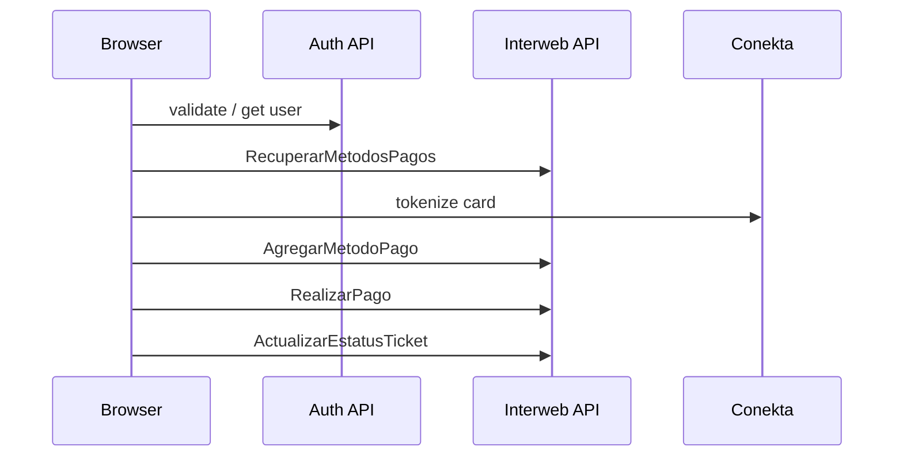

# Payments

This app processes ticket payments against the **Interweb API** (`api-interweb.*`) while authentication uses the **Auth API** (`api-authentication-v3.*`).

## Environment variables

| Variable | API | Purpose |
|----------|-----|---------|
| `VITE_BLIKON_API_URL` | Auth | Session validate / refresh / get user |
| `VITE_BLIKON_API_JWT` | Auth | Service JWT for auth cookie endpoints |
| `VITE_BLIKON_INTERWEB_API_URL` | Interweb | Payment methods + RealizarPago + ticket status |
| `VITE_BLIKON_INTERWEB_API_JWT` | Interweb | Bearer token for Interweb calls |
| `VITE_CONEKTA_PUBLIC_KEY` | Conekta | Tokenize new cards before `AgregarMetodoPago` |

Auth and Interweb are intentionally separate. Do not point `VITE_BLIKON_API_URL` at Interweb.

## Current architecture (Phase 2 — client-side)

Implementation lives in:

- [`src/services/paymentService.ts`](../src/services/paymentService.ts) — direct `fetch` calls
- [`src/components/payment/PaymentSection.tsx`](../src/components/payment/PaymentSection.tsx) — Stripe-like method picker, tips, pay CTA
- [`src/components/payment/AddPaymentMethodForm.tsx`](../src/components/payment/AddPaymentMethodForm.tsx) — inline add-card flow

## Payment payload mapping

| `RealizarPago` field | Source |
|----------------------|--------|
| `usuarioIdEmisor` | `authUser.user_id` |
| `usuarioIdReceptor` | `ticket.spaceid` |
| `importe` | `metadata.total` |
| `propina` | Selected tip % × importe |
| `metodoPagoId` | Selected payment method `id` |
| `emailEmisor` | Method email → user email fallback |
| `descripcion` / `urlOrigen` | `metadata.url` |
| `spaceId` | `ticket.spaceid` |
| `referencia` | `""` |
| `ticketId` | `metadata.ticketid` |

After a successful charge, the app calls `ActualizarEstatusTicket` with `cadenaEstatus: "Pagado"`.

## Target architecture (Netlify Functions migration)

Move Interweb calls behind Netlify Functions (or Supabase Edge Functions) so the Interweb JWT never ships in the browser bundle and amounts are re-validated server-side.

Recommended functions:

| Function | Replaces |
|----------|----------|
| `get-payment-methods` | `RecuperarMetodosPagos` |
| `add-payment-method` | `AgregarMetodoPago` (after Conekta token from client) |
| `execute-payment` | `RealizarPago` + server-side ticket re-fetch |
| `update-ticket-status` | `ActualizarEstatusTicket` |

### Migration checklist

1. Create Netlify functions under `netlify/functions/` mirroring [`paymentService.ts`](../src/services/paymentService.ts) routes.
2. Store `BLIKON_INTERWEB_API_URL` and `BLIKON_INTERWEB_API_JWT` as Netlify env vars (no `VITE_` prefix).
3. Forward the user's Blikon access token in `Authorization` (or validate session server-side) — never trust client-sent `usuarioIdEmisor` or amounts.
4. In `execute-payment`, re-read the ticket from Firebase, verify folio, recompute `importe` / `propina`, then post to `RealizarPago`.
5. Swap `paymentService.ts` to call `/.netlify/functions/*` instead of Interweb directly.
6. Remove `VITE_BLIKON_INTERWEB_API_JWT` from the frontend build.

### Security notes

- Client-side payment is acceptable for development; production should use server proxies.
- Conekta public key stays in the browser; only the token goes to `AgregarMetodoPago`.
- Rate-limit and log payment attempts in server functions before go-live.
